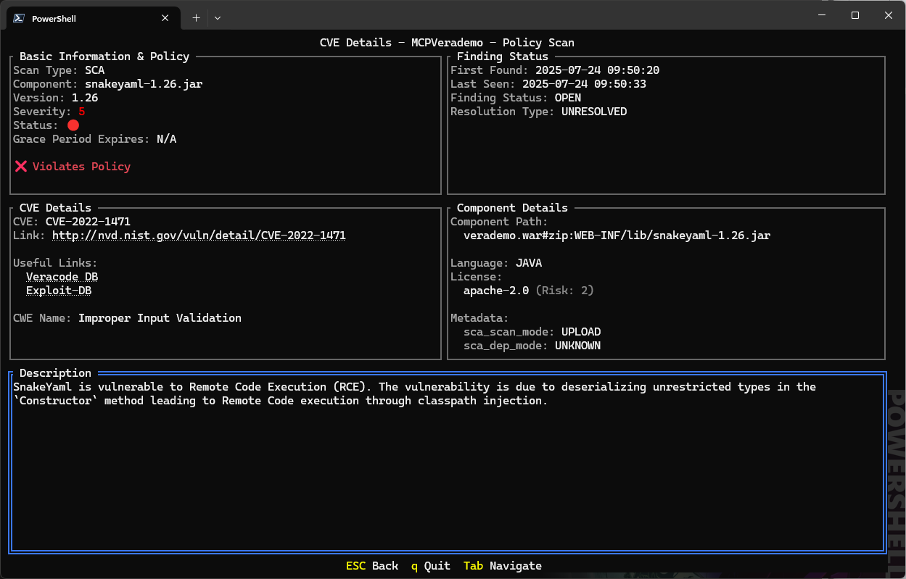

# Veracode TUI

A Terminal User Interface (TUI) application for accessing Veracode's API, built with Go.

## Features

- 🔐 Secure credential management via `~/.veracode/veracode.yml`
- 📋 List and browse Veracode applications
- 🔍 Search and filter applications
- 📊 View application details and scan findings
- 💬 Submit mitigation annotations (comment, approve, reject, etc.)
- 🎯 Real-time in-memory data updates
- ⌨️ Keyboard-driven interface
- 🎨 Beautiful terminal UI powered by tview
- 🎨 Theming support with monochrome mode for accessibility

###
Show ALL the findings


###
Show the finding details


###
SCA is covered too




## Prerequisites

- Go 1.24 or higher
- A Veracode account with API credentials
- `~/.veracode/veracode.yml` configuration file

## Installation

### 1. Install Go

If you haven't installed Go yet, download it from [https://golang.org/dl/](https://golang.org/dl/)

For Windows, you can use:
```powershell
winget install GoLang.Go
```

### 2. Clone or navigate to the repository

```powershell
cd E:\Github\veracode-tui
```

### 3. Download dependencies

```powershell
go mod download
```

### 4. Build the application

```powershell
go build -o veracode-tui.exe
```

## Configuration

The application reads API credentials from `~/.veracode/veracode.yml`. The file should have the following structure:

```yaml
api:
    key-id: your-api-key-id
    key-secret: your-api-key-secret
oauth:
    enabled: false
    region: ""
```

On Windows, the configuration file should be located at:
```
C:\Users\<YourUsername>\.veracode\veracode.yml
```

## Usage

### Run the application

Start the interactive TUI:
```powershell
.\veracode-tui.exe
```

Or directly with Go:
```powershell
go run main.go
```

### Command-line Options

```
veracode-tui              Start the interactive TUI
veracode-tui --healthcheck  Test API connectivity and credentials
veracode-tui --version      Show version information
veracode-tui --no-color     Disable colors (monochrome mode)
veracode-tui --help         Show this help message
```

**Environment Variables:**
- `NO_COLOR` - When set, disables all colors (follows https://no-color.org/ standard)

### Healthcheck mode

Test your API credentials and connectivity without opening the TUI:

```powershell
.\veracode-tui.exe --healthcheck
```

**Output on success:**
```
🏥 Performing Veracode API healthcheck...
✅ Healthcheck successful - API is operational and credentials are valid
```

This will:
- ✅ Verify your credentials are valid
- ✅ Check that Veracode API services are operational
- ✅ Exit with status 0 on success, 1 on failure
- ✅ Perfect for quick testing or CI/CD pipeline validation

### Keyboard Controls

- `↑/↓` or `j/k` - Navigate through lists
- `Enter` - View details or submit findings
- `/` - Search/filter applications
- `m` - Open mitigation modal (on finding detail view)
- `Ctrl+S` - Submit annotation (in modal)
- `Tab` - Navigate between fields
- `Esc` - Go back or close modal
- `q` or `Ctrl+C` - Quit the application

## Project Structure

```
veracode-tui/
├── main.go              # Application entry point
├── config/              # Configuration management
├── veracode/            # API client and HMAC authentication
│   ├── auth.go          # HMAC-SHA256 signing
│   └── client.go        # HTTP client with HTTPError type
├── services/            # Service layer for API operations
│   ├── applications/    # Applications API (models, service, tests)
│   ├── findings/        # Findings API (models, service, tests)
│   ├── annotations/     # Annotations API (models, service, tests)
│   └── identity/        # User identity API
└── ui/                  # TUI implementation with multiple views
```

## Architecture

### Components

1. **Config Package** (`config/`)
   - Reads and parses `~/.veracode/veracode.yml`
   - Validates API credentials

2. **Veracode Package** (`veracode/`)
   - **auth.go**: Implements Veracode's HMAC-SHA256 authentication
   - **client.go**: HTTP client for interacting with Veracode API
   - Supports both legacy XML and modern REST APIs

3. **Services Package** (`services/`)
   - **applications**: Service layer for Applications API
   - Provides clean Go interface to Veracode REST APIs
   - Full type safety with structured data models
   - Comprehensive integration tests

4. **UI Package** (`ui/`)
   - Built with [tview](https://github.com/rivo/tview)
   - Implements applications list, findings list, and detail views
   - Handles keyboard input and navigation
   - Displays real-time data from Veracode API

### Authentication

The application uses Veracode's HMAC-SHA256 authentication scheme:
1. Generates a random 16-byte nonce
2. Gets current timestamp in milliseconds
3. Creates a signing string with API key ID, host, URL, and HTTP method
4. Performs a four-level HMAC-SHA256 chain:
   - HMAC(nonce, api_secret)
   - HMAC(timestamp, result1)
   - HMAC("vcode_request_version_1", result2)
   - HMAC(data, result3)
5. Includes the signature in the Authorization header

### Veracode APIs Used

- **Applications API** (`/appsec/v1/applications`)
  - List and retrieve application details
  - Access sandboxes and scan information

- **Findings API** (`/appsec/v2/applications/{guid}/findings`)
  - Retrieve security findings (static, dynamic, SCA)
  - Filter by severity, scan type, and policy compliance

- **Annotations API** (`/appsec/v2/applications/{guid}/annotations`)
  - Submit mitigation annotations
  - Comment on findings and mark false positives

- **Identity API** (`/api/authn/v2/users/self`)
  - Get current user information
  - Used for annotation attribution

- **Healthcheck API** (`/healthcheck/status`)
  - Test API connectivity and credentials
  - Used by `--healthcheck` flag

## Current Features

✅ **Application Management**
- List all applications from your Veracode account
- View detailed application information (policies, teams, scans)
- Search and filter applications by name
- View application details including:
  - Business unit and criticality
  - Policy compliance status
  - Associated teams
  - Scan history and status
  - Creation and modification dates

✅ **Findings Analysis**
- Browse findings by scan type (Static, Dynamic)
- Filter by severity (Very High, High, Medium, Low, Very Low)
- Filter by policy compliance (All, Violations, Non-Violations)
- View detailed finding information
- See mitigation status and annotations
- Real-time comment indicator (💬) for recent comments

✅ **Mitigation Annotations** 🆕
- Submit annotations directly from the TUI
- Support for multiple action types:
  - 💬 Comment - Add explanatory comments
  - ✓ False Positive - Mark as false positive
  - ✓ App Design - Mitigated by design
  - ✓ OS Environment - OS-level mitigation
  - ✓ Network Environment - Network-level mitigation
- In-memory data updates (instant UI refresh)
- Structured error handling with HTTP status codes
- Username auto-population from identity service

✅ **Architecture & Quality**
- HMAC-SHA256 authentication
- Healthcheck endpoint for quick testing
- Service layer architecture for clean API access
- HTTPError type with status code, status text, and response body
- Type-safe enums (ScanType, Status, ResolutionStatus, ScanFilterType, PolicyFilterType)
- Pointer-based in-memory cache updates
- Comprehensive integration tests  

## Planned Features (Future Read-Write Support)

- 📝 Create new applications
- 🗑️ Delete applications
- 📤 Upload builds
- 🔧 Modify application settings
- 📊 View scan results
- 📈 Generate reports

## Dependencies

- [tview](https://github.com/rivo/tview) - Terminal UI framework
- [tcell](https://github.com/gdamore/tcell) - Terminal handling and styling
- [yaml.v3](https://github.com/go-yaml/yaml) - YAML parsing

## Development

### Prerequisites

Install development tools:
```bash
make install-tools
```

This installs:
- golangci-lint (linter)
- goimports (code formatter)

### Build and Test

```bash
# Build the application
make build

# Run tests with race detection
make test

# Run tests with coverage report
make test-coverage

# Format code
make fmt

# Run linter
make lint

# Run all checks (fmt, vet, lint, test, build)
make all
```

### Manual Commands

```bash
# Run tests
go test ./...

# Run tests with verbose output
go test -v ./...

# Update dependencies
go get -u ./...
go mod tidy
```

### Live Reload (optional)

```bash
go install github.com/cosmtrek/air@latest
air
```

### Code Quality

This project uses:
- **golangci-lint** for comprehensive linting
- **GitHub Actions** for CI/CD
- **go vet** for suspicious code detection
- **go test -race** for race condition detection

Configuration files:
- `.golangci.yml` - Linter configuration
- `Makefile` - Build and test targets
- `.github/workflows/go.yml` - CI pipeline

## Troubleshooting

### "Error loading configuration"

Ensure your `~/.veracode/veracode.yml` file exists and contains valid API credentials.

### "API request failed"

- Verify your API credentials are correct
- Check your internet connection
- Ensure your Veracode API access is active

### "The term 'go' is not recognized"

Go is not installed or not in your PATH. Install Go from [https://golang.org/dl/](https://golang.org/dl/)

## Accessibility

### Color Support

The application supports both color and monochrome modes:

**Monochrome Mode:**
```powershell
# Using command-line flag
.\veracode-tui.exe --no-color

# Using environment variable (NO_COLOR standard)
$env:NO_COLOR=1
.\veracode-tui.exe
```

When in monochrome mode, the TUI uses only grayscale colors and relies on symbols and text formatting for visual distinction.

## Contributing

Contributions are welcome! Please feel free to submit a Pull Request.

## License

MIT License - feel free to use this project for your own purposes.

## Security Notes

- ⚠️ Never commit your `veracode.yml` file with real credentials
- 🔒 Keep your API credentials secure
- 🛡️ The application reads credentials from your home directory only
- 🔐 Credentials are never logged or displayed

## Resources

- [Veracode API Documentation](https://docs.veracode.com/r/Veracode_APIs)
- [Veracode HMAC Authentication](https://docs.veracode.com/r/c_enabling_hmac)
- [tview Documentation](https://github.com/rivo/tview)
- [tcell Documentation](https://github.com/gdamore/tcell)
